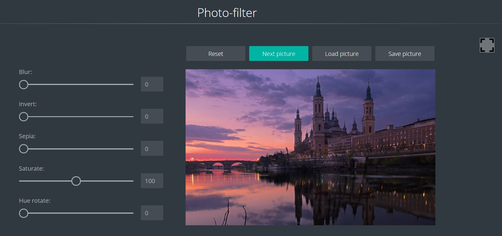

# Task 8. Photo-filter от [RSS School](https://rs.school/)

## Проект Photo-filter [готовый](https://marinatwice82.github.io/photo-filter/)

## Описание:
* на странице отображается стартовое изображение и настройки css-фильтров  blur,  invert ,  saturate ,  sepia , hue rotate в виде ползунков, каждому из которых соответствует определённый css-фильтр. Дополнительные фильтры можно добавить по своему усмотрению.
* стартовое изображение загружается из файлов самого приложения. Его соответствие времени суток не требуется.
* над изображением есть четыре кнопки, каждой из которых соответствует определённый функционал:
    * кнопка  Reset  позволяет сбросить настройки css-фильтров
    * кнопка  Next picture предназначена для смены изображений, которые загружаются с внешнего ресурса по ссылке
    * кнопка  Load picture для загрузки изображения с компьютера
    * кнопка  Save picture позволяет скачать изображение вместе с добавленными фильтрами на компьютер

## [Описание задания](https://rolling-scopes-school.github.io/stage0/#/stage1/tasks/js-projects/photo-filter)
